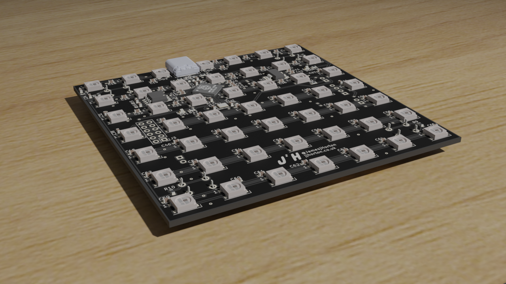
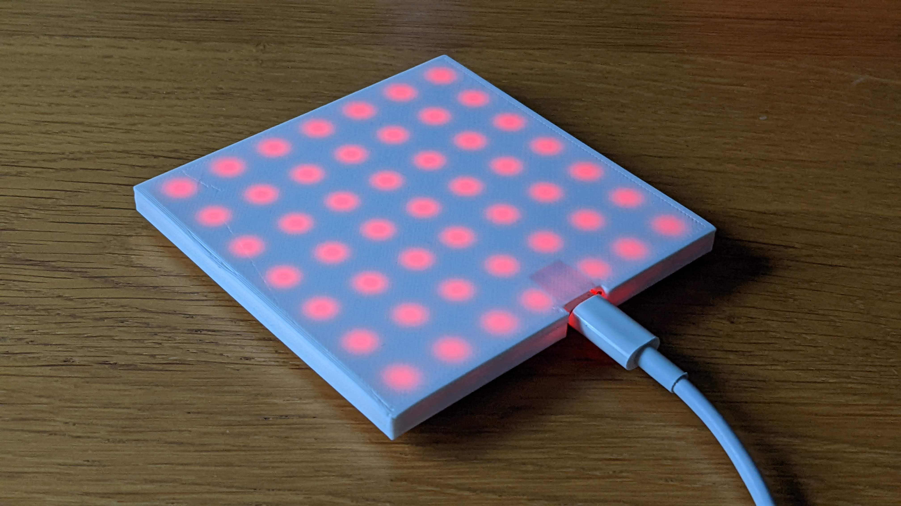
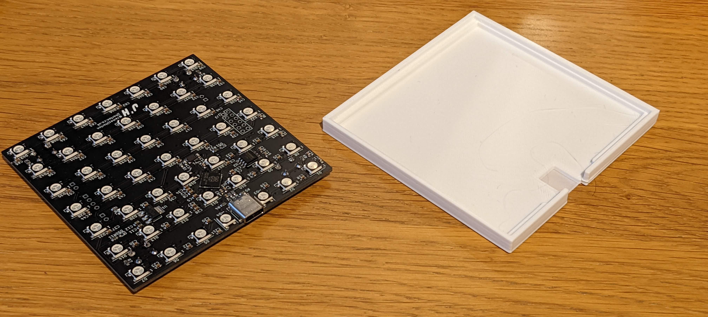

# Rp2040_Coaster

## Introduction
The idea was to build a light up drinks coaster, which would sit under a clear glass drinks bottle and light it up in a colorful display, only when the bottle is on top. 

## Building 

The main circuit is built around a RP2040, using the WS2812B "Neopixels" as the LEDs to create the colours, and a USB-C connector for power and programming. The PCB is designed using Kicad, and makes use of a simple 2 layer PCB, the examples here are made using JLCPCB, but any should work. 

The control software is written in C and is based of the PIO example from the Raspberry Pi example repo, the colours are generated based on the inputs of the 4 switches under the PCB. If two of the 4 switches are on, the light display begins, fading between pre-generated color pattern, which repeats. 

The PCB is placed under a 3d Printed case, this protects the PCB and electronics from any liquid or condensation on a cold bottle, the case is designed using openscad and the examples shown were printed on an Ender3 3D printed, and it should be possible to produce with most cheap 3D printers. 

## License 
Open Hardware License 
